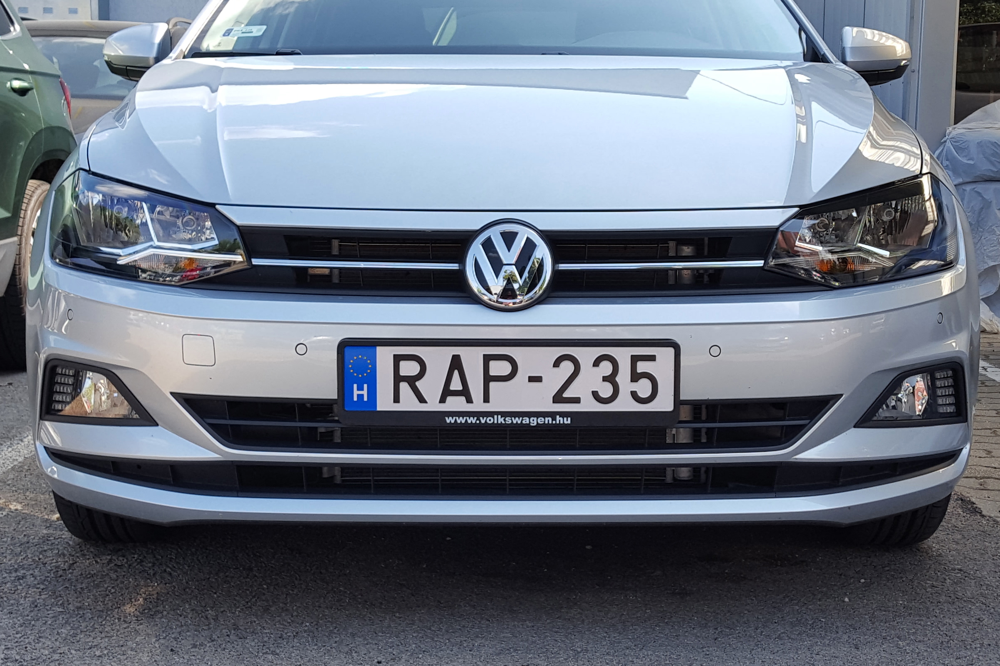

Ez a projekt a **Képfeldolgozás alap algoritmusai** kurzus keretein belül készült, és egy rendszámfelismerő alkalmazást valósít meg. Az alkalmazás képes képek alapján rendszámokat azonosítani, és azokat szöveges formára alakítani.

- **GitHub**: [Áttekintés](https://github.com/Barni6/license_plate_detection)

## Funkciók

- **Grafikus Felhasználói Felület (GUI)**:
  - Tkinter alapú felület, amely egyszerű használatot biztosít.
- **Képfeldolgozás**:
  - A kép előfeldolgozásához több lépést használ, például szürkeárnyalatos konvertálás, zajszűrés és kontúrfelismerés.
- **Optikai Karakterfelismerés (OCR)**:
  - A rendszámot Tesseract OCR technológia segítségével ismeri fel.
- **Képkezelés**:
  - Betöltött képek megjelenítése és feldolgozása. (A képek felbontása és az ablak méretezése nincsen kezelve a kódban.)
- **Rendszám kiemelése**:
  - A rendszámtáblák automatikus felismerése és szöveggé alakítása.

## Telepítés

1. **Követelmények telepítése**:
   - Győződj meg róla, hogy a következő Python könyvtárak telepítve vannak:
     ```bash
     pip install opencv-python-headless pillow pytesseract imutils numpy
     ```
   - Telepítsd a Tesseract OCR eszközt:
     - [Tesseract OCR telepítési útmutató](https://github.com/tesseract-ocr/tesseract).

2. **Futtatás**:
   - Indítsd el a programot a következő paranccsal:
     ```bash
     python main.py
     ```

## Használat

1. **Kép betöltése**:
   - Használj a "Kép betöltése" gombot a kívánt kép kiválasztásához.
2. **Rendszám felismerése**:
   - Kattints az "Előfeldolgozás és rendszám szövegének kiírása" gombra, hogy a program kiemelje és felismerje a rendszámot.
3. **Eredmények megjelenítése**:
   - Az OCR által kiolvasott rendszám megjelenik a felhasználói felületen.

## Technológiák

### Nyelv
- **Python**

### Könyvtárak és eszközök
- **OpenCV**: Képfeldolgozáshoz.
- **Pillow**: Képek megjelenítéséhez.
- **Tkinter**: Grafikus felhasználói felülethez.
- **Pytesseract**: Optikai karakterfelismeréshez.
- **Imutils**: Képfeldolgozási segédfüggvények.

## Példa Képernyőképek

### Kezdőképernyő


### Rendszám Felismerése


## Megjegyzések

- A program futtatása előtt győződj meg arról, hogy a Tesseract OCR helyesen van telepítve, és a futtatható fájl elérési útvonala megfelelő.
- Az OCR eredménye a betöltött kép minőségétől és a rendszám elhelyezkedésétől függően változhat.

