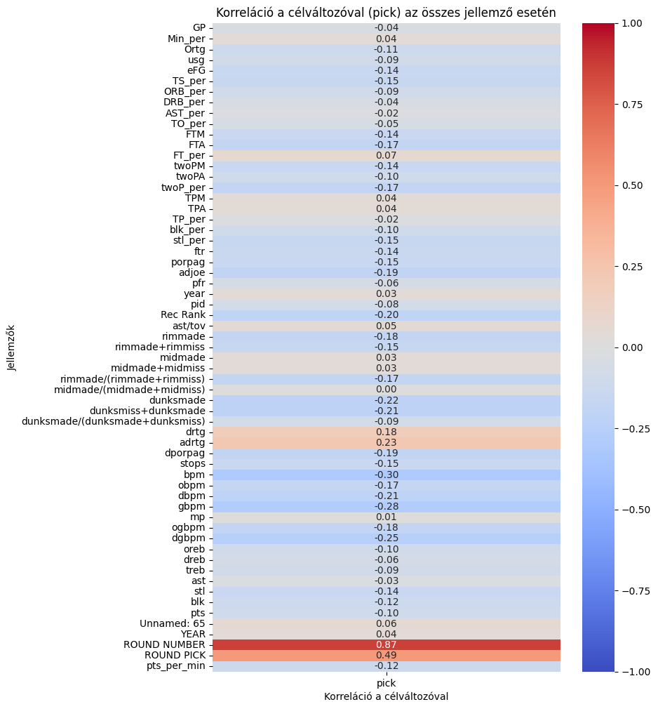
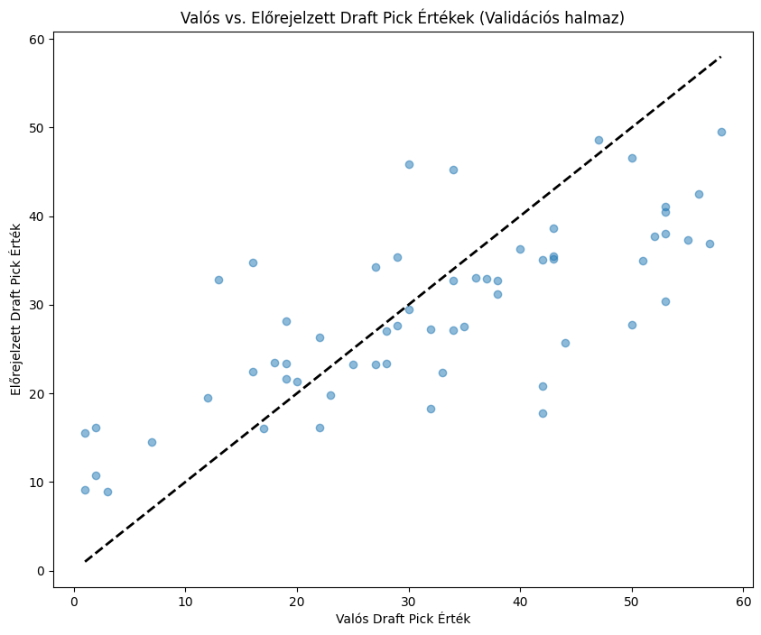
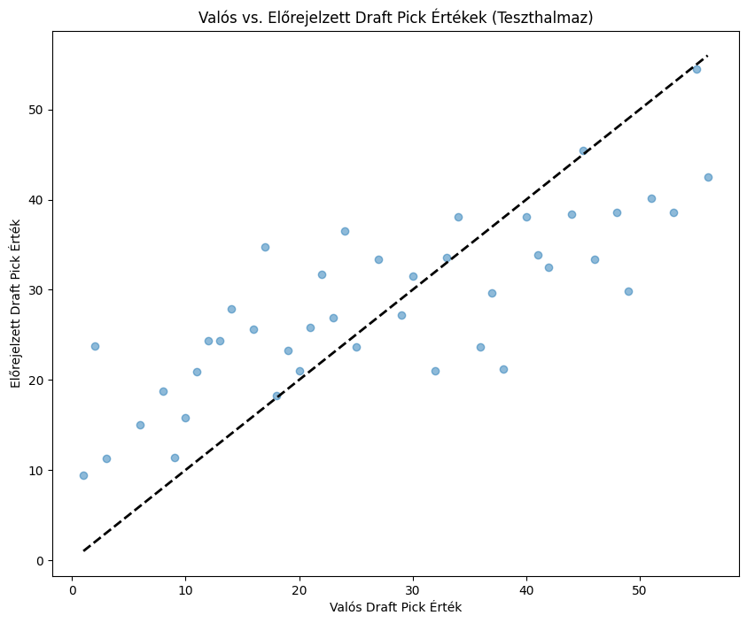
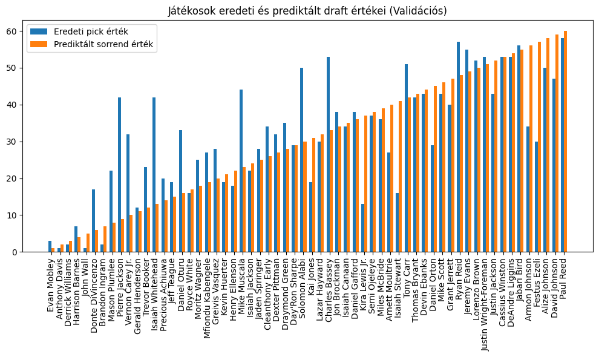
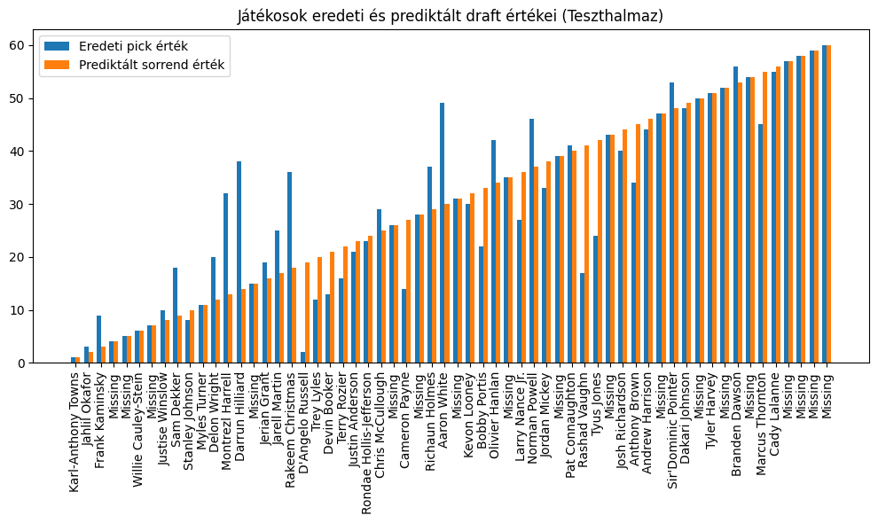
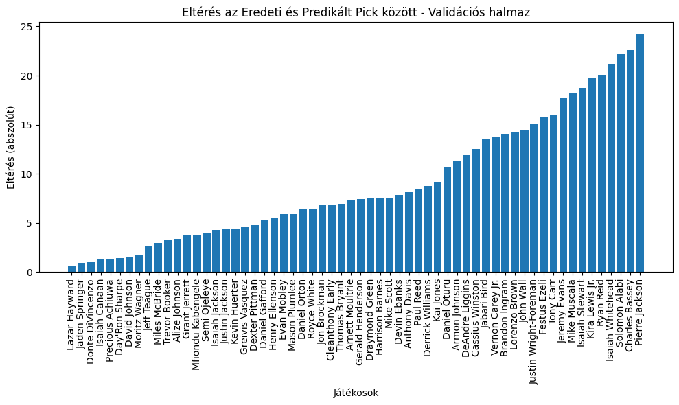
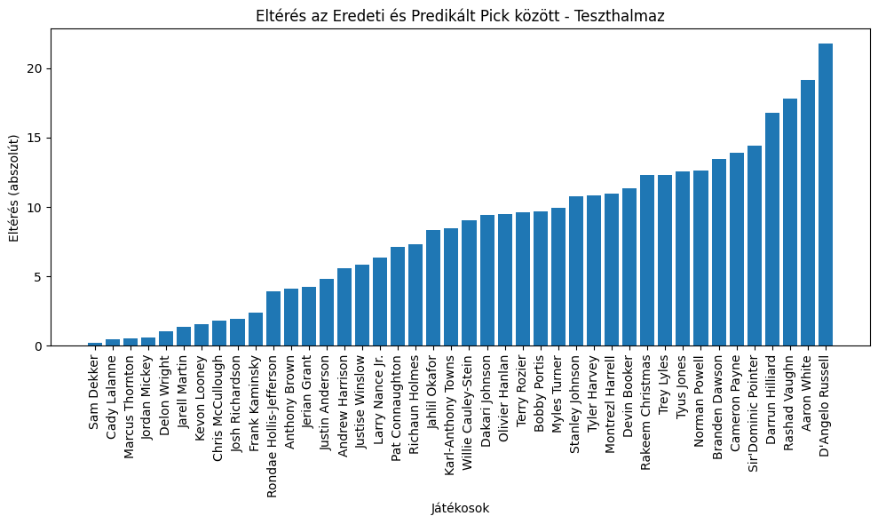

Ez a projekt az **NBA Draft Prediction** problémára fókuszál, ahol gépi tanulási technikák segítségével igyekszem pontosan előre jelezni a draft során elvárható játékos helyezéseket. A cél egy olyan modell fejlesztése, amely figyelembe veszi az egyetemi kosárlabdázók különféle statisztikai adatait, és ezek alapján megbecsüli a draft pick helyezést. (A projekt saját átfogóbb és részletesebb dokumentációt tartalmaz.)

- **GitHub**: [Áttekintés](https://github.com/Barni6/NBA_Draft_Prediction)

## Tartalomjegyzék
1. [Projekt Áttekintés](#projekt-áttekintés)
2. [Könyvtárak és Technológiák](#könyvtárak-és-technológiák)
3. [Adatok](#adatok)
4. [Modellépítés és Kiértékelés](#modellépítés-és-kiértékelés)
5. [Vizualizációk](#vizualizációk)

## Projekt Áttekintés

A projekt fő célkitűzései:
- **Előrejelzés**: Egyedi játékos statisztikák alapján megbecsülni a draft pick értékét.
- **Hiperparaméter-optimalizálás**: A Keras Tuner segítségével optimalizálni a modell teljesítményét.
- **Elemzés és Vizualizáció**: Korrelációs elemzések, predikciók értékelése és grafikus ábrázolása.

A modell a következő feladatokat végzi el:
1. **Adatok betöltése és előkészítése**.
2. **Jellemzők kiválasztása** a célváltozóval való korreláció alapján.
3. **Hiperparaméter-optimalizálás** egy pointwise modell építéséhez.
4. **Validációs és teszt eredmények kiértékelése**.
5. **Hiányzó draft helyek kezelése és teljes rangsor létrehozása**.

## Könyvtárak és Technológiák

### Könyvtárak
- **numpy, pandas**: Adatkezelés és feldolgozás.
- **sklearn**: Adatelőkészítés, validáció és metrikák.
- **tensorflow.keras**: Modellépítés, tanítás és kiértékelés.
- **keras_tuner**: Hiperparaméter-optimalizálás.
- **matplotlib, seaborn**: Grafikonok és hőtérképek megjelenítése.

### Technológiák
- **Adatfeldolgozás**: RobustScaler skálázás a jellemzők stabilizálása érdekében.
- **Modellépítés**: Pointwise regressziós modell több rejtett réteggel és dropout mechanizmussal.
- **Optimalizálás**: Adam optimalizáló, EarlyStopping és ReduceLROnPlateau callbackek.

## Adatok

### Adatkészlet
- **drafted_players**: A 2009-2021 közötti NBA draftolt játékosok adatai.
- **all_players_data**: Az összes egyetemi kosárlabdázó adata azonos időszakból.

### Adatok előkészítése
1. **Összekapcsolás**: Draftolt és nem draftolt játékosok adatainak összekapcsolása.
2. **Szűrés**: Duplikált sorok eltávolítása, új jellemzők létrehozása (`pts_per_min`).
3. **Adathalmazok szétválasztása**:
   - Tanító/validációs halmaz: Nem 2015-ös játékosok.
   - Teszthalmaz: 2015-ös játékosok.

## Modellépítés és Kiértékelés

### Modellépítés
- **Pointwise Modell**:
  - Rejtett rétegek neuron száma és dropout aránya optimalizálva.
  - Lineáris aktivációs kimeneti réteg.

### Hiperparaméter-optimalizálás
- Keras Tuner segítségével 10 próbálkozás és 2 futtatás alapján optimalizált modell.
- Validációs MAE minimalizálása.

### Kiértékelési metrikák
- **MAE**: Átlagos abszolút eltérés.
- **R²**: Modell illeszkedésének mértéke.

### Eredmények
- Validációs és teszt predikciók MAE és R² értékei kiemelve.
- Validation MAE: 8.994453525543213
- Validation R²: 0.5080301474784779
- Test MAE: 8.240730194818406
- Test R²: 0.6052464262021787

## Vizualizációk

### Korrelációs Mátrix
A célváltozóval (pick) való kapcsolat ábrázolása:

- Korreláció erdményei lapján tanításra felhasznált változók:

features =  ['Ortg', 'eFG', 'TS_per', 'FTM', 'FTA', 'twoPM', 'twoP_per', 'stl_per', 
            'ftr', 'porpag', 'adjoe', 'drtg', 'adrtg', 'dporpag', 'stops',
            'bpm', 'obpm', 'dbpm', 'gbpm', 'ogbpm', 'dgbpm', 'oreb', 'stl', 'blk', 'pts_per_min']

### Scatter Plotok
A valós és előrejelzett nyers predikció értékek összehasonlítása:
- **Validációs halmaz**:

  
- **Teszthalmaz**:

  

### Predikciók Vizualizálása
Sorrend felállítása az eredeti és prediktált pick értékek alapján:
- **Validációs halmaz**:
  
- **Teszthalmaz**:
  

### Eltérések Ábrázolása
Az eredeti és preditált pick értékek közötti különséget szemléltető ábrák:
- **Validációs halmaz**:
  
- **Teszthalmaz**:
  

